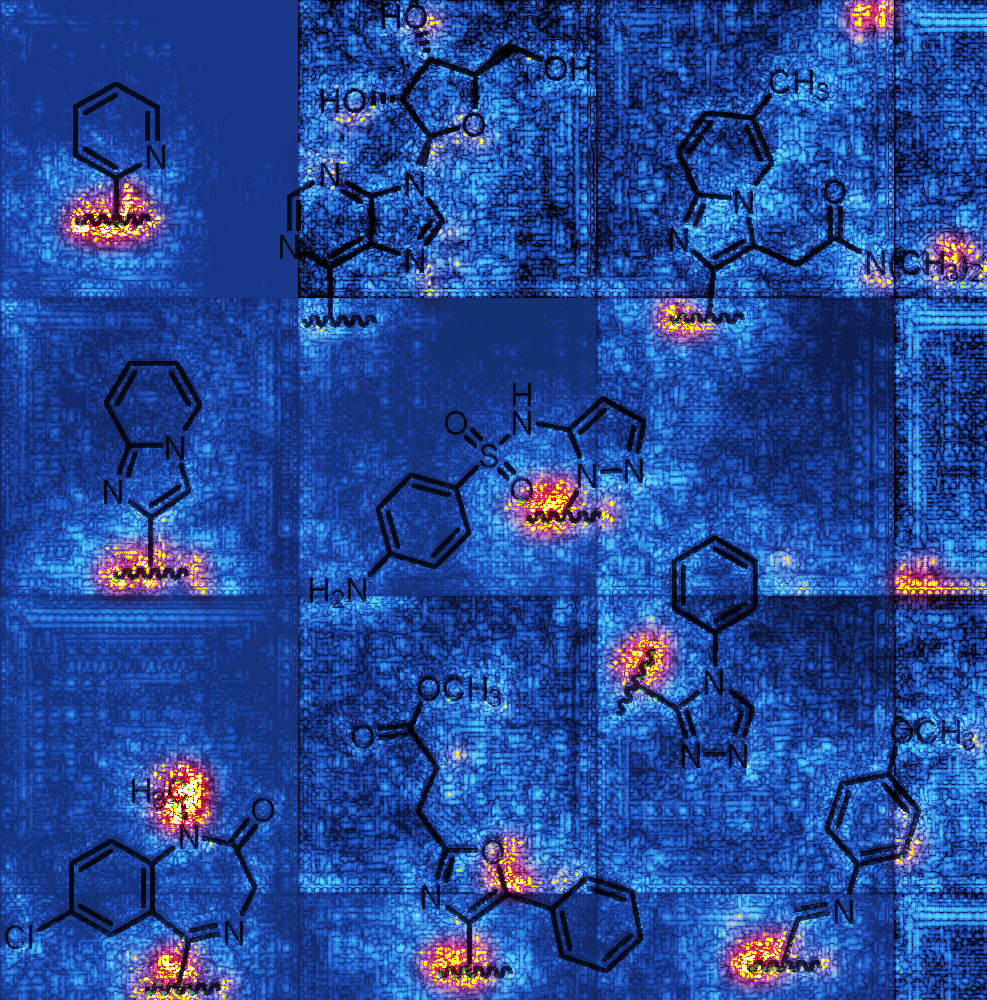
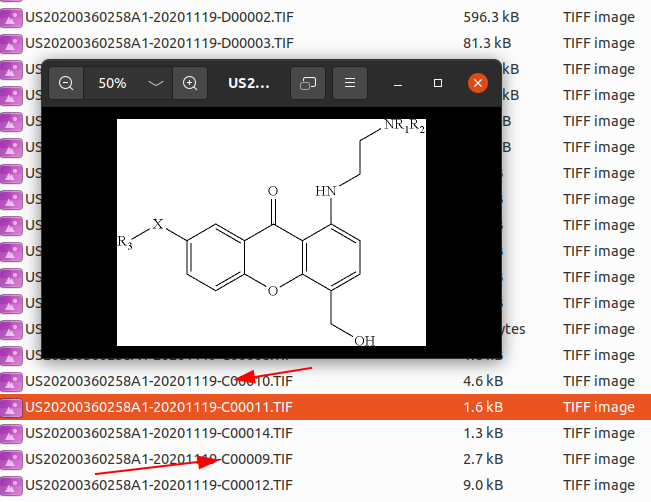
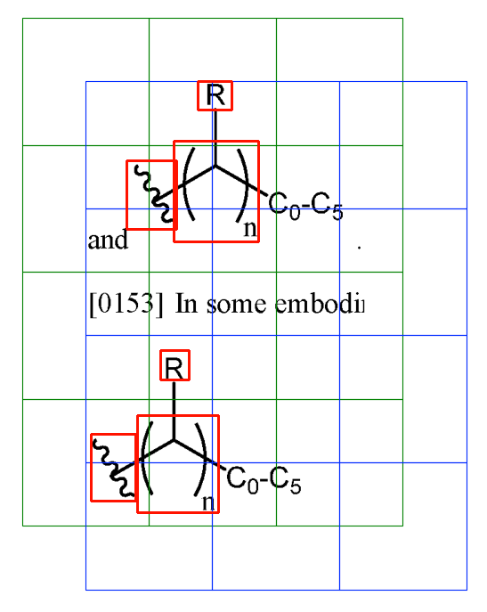

# One Strike, You’re Out: Detecting Markush Structures in Low Signal-to-Noise Ratio Images

      

This repository contains the code for my Masters' Thesis, dedicated to detecting Markush structures in image containing chemical structures. The thesis can be read [here](assets/Thomas_Jurriaans_MSc_Information_Studies_DS_Master_Thesis.pdf). It is recommended to read it to understand what the function and goal of the code in this repository is.

## Reproduction
In order to reproduce the research, you can use the code available in this repository. However, some adaptations will be required.

### Data
For legal reasons, the exact (processed, labeled and annotated) data that was used during this project at Elsevier can not be shared. However, the underlying data is available from the US Patent and Trademark Office (USPTO). Bulk data can be downloaded from the USPTO here: https://bulkdata.uspto.gov/data/patent/application/redbook/2021/

    

Images containing chemical structures can easily be extracted by filtering based on the filename. For chemical images, after the date there is always a "C" as the first character of the identifier.

### Labeling and Annotation
After extraction, the images must still be labeled and annotated. The current code is set up to use 2 folders (data/training/Markush and data/training/NoMarkush) to seperate classes. A single JSON file is used which contains the annotation information for the Markush images. For this project, [Label Studio](https://labelstud.io/) was used for labeling. Use the JSON-MIN export format to get annotations compatible with this project.

    

### Code
This project was an exploratory data science project, with the goal of creating a proof of concept. Therefore the code is not extremely clean or well-tested. If you make any improvements, feel free to submit a pull-request!

#### Modules - markush.py

The `MarkushDataset` class inherits from the PyTorch `Dataset` class and implements its required methods. It is used to load data from disk and make it available for further use. Despite there being a seperate `PatchesDataset`, `MarkushDataset` also creates patches from the images, which are used by the ORB method as templates. These patches differ from the ones made by `PatchesDataset` in that they are always centered on a Markush annotation. This is not an ideal setup, and could be improved by moving this functionality elsewhere, for example with a `TemplatesDataset`.

#### Modules - orbGridSearch.py

This script provides helper functions for `orb_grid_search.ipynb`.

#### Modules - patches.py
The `PatchesDataset` class also inherits from PyTorch's `DataSet`. Instances of this class are made by converting all images `MarkushDataset` into the patches that constitute them. The class also determines the label of each patch.

#### dataloading_and_processing.ipynb

A notebook showing how to use `MarkushDataset` and `PatchesDataset`. Also includes some visualizations made later in the project, outputs included for illustrative purposes.

#### evaluate_only.py

This is a modified version of `Optuna.py` which only evaluates a model, and allows for extra functionality. A trained model is required to use this script. It allows for generation of saliency maps using `ERROR_INVESTIGATION`. It also allows for the evaluation of datasets that do not have annotations, but only image-level labels using `PATCH_LEVEL_RESULTS`. This script is quite thrown together, and not well documented. Use at your own discretion ;).

#### exploratory_data_analysis.ipynb

A notebook with the EDA that was part of the thesis. Outputs are included.

#### optuna.py

The main training script for the CNNs. Uses the Optuna library for hyperparameter optimization. Can simply be run with `python ./Optuna.py` after setting parameters in the script. This script has gotten quite convoluted, and does the following things:

- Load data, create torch dataloaders
- Define a new or load an existing model
- Run Optuna trials in order to find optimal hyperparameters
  - During these trials the models are trained and evaluated on the train and validation set
  - Early stopping is used
- With the best hyperparameters, evaluate the models on the test set and output statistics.

The parameters of the script can be set above `if __name__ == '__main__':` at the bottom of the script.

#### orb_for_classification_multiple.ipynb

This notebook contains the code that became `orbGridSearch.py`, as well as visualizations for ORB classification. Outputs are included for illustrative purposes.

#### orb_grid_search.ipynb

This notebook uses `orbGridSearch.py` to search the hyperparameter grid for the ORB method. It finds the optimal hyperparameters and saves them to disk.

#### ROC_curve.ipynb

A simple notebook for generation ROC curves.
